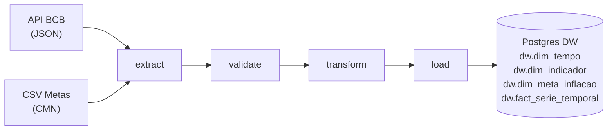

# Pipeline de Indicadores Macroeconômicos Brasileiros

Pipeline ETL end-to-end que consolida dados do **Banco Central do Brasil** e do **CMN** num Data Warehouse Postgres, orquestrado pelo Apache Airflow.

**Disciplina:** Data Integration — ESPM 2026.1

---

## Fontes de Dados

| Fonte | Tipo | Séries |
|---|---|---|
| [API BCB](https://api.bcb.gov.br) | REST / JSON | SELIC diária, IPCA mensal, Câmbio USD/BRL |
| `data/metas_inflacao.csv` | CSV estático | Metas de inflação do CMN (2015–2025) |

---

## Arquitetura



Para detalhes de decisões técnicas, ver [`docs/ARCHITECTURE.md`](docs/ARCHITECTURE.md).

---

## Pré-requisitos

- Docker 24+
- Docker Compose v2

---

## Como Executar

```bash
# 1. Clone o repositório
git clone <URL_DO_REPO>
cd <pasta>

# 2. Copie e ajuste as variáveis de ambiente
cp .env.example .env

# 3. Suba todos os serviços
docker compose up --build -d

# 4. Aguarde a inicialização (~60s) e acesse o Airflow
#    http://localhost:8080  (usuário: admin / senha: admin)

# 5. Ative a DAG "macro_pipeline" na interface e dispare manualmente
#    ou aguarde o agendamento (toda segunda às 06h UTC)
```

### Verificar os dados no DW

```bash
# Conectar ao banco dw
docker exec -it <container_postgres> psql -U dw -d dw

# Rodar as queries analíticas
\i /sql/queries.sql
```

---

## Queries de Valor

Definidas em [`sql/queries.sql`](sql/queries.sql):

1. **SELIC média mensal** — evolução da taxa básica de juros
2. **IPCA acumulado × meta CMN** — o Brasil cumpriu a meta de inflação?
3. **Câmbio USD/BRL por trimestre** — média, máxima, mínima e amplitude

---

## Testes

```bash
# Instalar dependências localmente
pip install -r requirements.txt

# Rodar testes
pytest tests/ -v
```

---

## Modelagem do DW

```
dim_indicador ──┐
                ├──► fact_serie_temporal ◄── dim_tempo
dim_meta_inflacao  (join por ano)
```

Grão do fato: **um valor por indicador por data**.

---

## Stack

| Camada | Ferramenta |
|---|---|
| Linguagem | Python 3.11 |
| Orquestração | Apache Airflow 2.9 |
| Banco de dados | PostgreSQL 15 |
| Conteinerização | Docker + Docker Compose |
| Testes | pytest |

---

## Uso de IA

Claude (Anthropic) foi utilizado para: geração e revisão da arquitetura, scaffolding dos módulos ETL, escrita do DDL e das queries SQL, e estruturação da documentação.
Todo o código foi revisado e adaptado pelo grupo.
